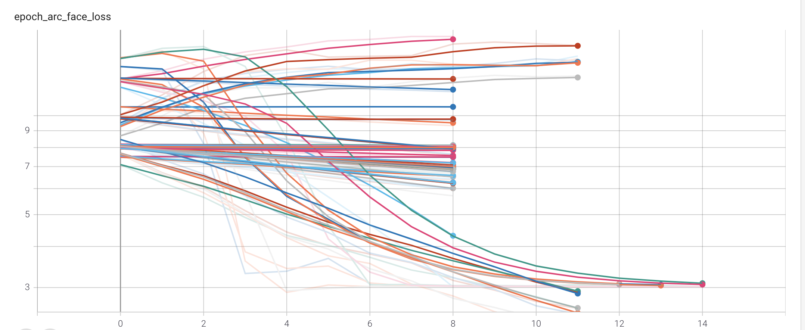
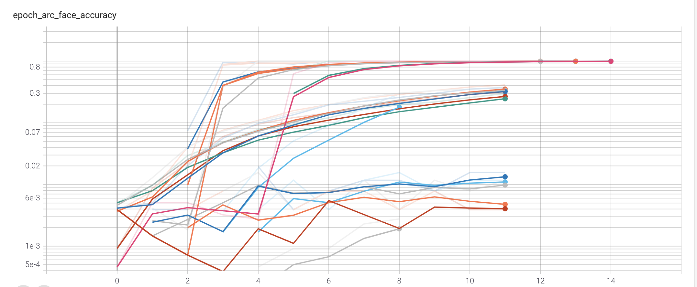

# AutoKeras-ArcFaceHead
ArcFace head module for Autokeras - Network architecture search for Automated Image feature extraction

Arcface based classification head block supporting huge number of classes in Autokeras for automated image feature extraction.

## Based on : 

* keras implementation of Arcface layer
```
Source: https://github.com/4uiiurz1/keras-arcface
```

* An AutoML system based on Keras
```
Source: https://github.com/keras-team/autokeras
Jin, H., Song, Q., and Hu, X. 2019. Auto-Keras: An Efficient Neural Architecture Search System. In Proceedings of the 25th ACM SIGKDD International Conference on Knowledge Discovery & Data Mining (pp. 1946–1956).
```

## Tested on :

* Products-10K : 9690 classes
```
Source - https://products-10k.github.io/
Bai, Y., Chen, Y., Yu, W., Wang, L. and Zhang, W., 2020. Products-10K: A Large-scale Product Recognition Dataset. arXiv preprint arXiv:2008.10545.
```

* GroceryDataset : 81 classes
```
Source - https://github.com/marcusklasson/GroceryStoreDataset
Klasson, M., Zhang, C., and Kjellström, H. 2019. A Hierarchical Grocery Store Image Dataset with Visual and Semantic Labels. In IEEE Winter Conference on Applications of Computer Vision (WACV).
```


## Sample results on Grocery dataset :


Figure 1 : epoch_loss plot for all trials (Tensorboard)


Figure 1 : epoch_top5_categorical_accuracy plot for all trials (Tensorboard)


Figure 3 : epoch_accuracy plot for all trials (Tensorboard)


# Usage

```
import autokeras as ak
from keras.callbacks import EarlyStopping

num_classes = 100000        # set to exact number of distinct classes in target or do : len(y_true)

input_node = ak.ImageInput()
input_node2 = ak.Input()

embedding_node = ak.DenseBlock(name='embedding_common', use_batchnorm=True)(input_node)
output_node = ArcFaceHead(name='arc_face', dropout=0.5, num_classes=num_classes, face_weight_decay=1e-04)([embedding_node, input_node2])

# Initialize the image classifier.
clf = ak.AutoModel(
    inputs=[input_node, input_node2],
    outputs=[output_node],
)

tensorboard_callback = tf.keras.callbacks.TensorBoard(log_dir='automodel-log')
es = EarlyStopping(monitor='val_arc_face_accuracy', mode='max', min_delta=1e-06, patience=8)

clf.fit([x_train, y_train_onehot], [y_train_onehot], callbacks=[tensorboard_callback, es])

model = clf.export_model()

encoder_model = keras.Model(inputs=model.input[0], outputs=model.get_layer("arcface_embedding").output)


# extract features

sample_features = encoder_model.predict(x_samples)

```

PS. I am a poor student, If you find it useful consider giving me a shoutback, mention or like please :)
